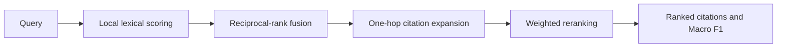

# Graph-Augmented Legal Information Retrieval

> A reproducible research package for ranking potentially relevant Swiss legal
> citations. It supports legal-information research, not legal advice.

[](https://github.com/sarthak11jain/Agentic-Legal-Information-Retrieval-System/actions/workflows/ci.yml)
[](https://www.python.org/)
[](LICENSE)

## Why this project

Complex Swiss-law questions can require several connected authorities rather
than one semantically similar document. The supported package demonstrates a
deterministic retrieval cascade: lexical candidate scoring, reciprocal-rank
fusion, one-hop citation expansion, weighted reranking, and citation-level
evaluation.

The original competition work placed **44th of 584 teams** on the completed
Kaggle *LLM Agentic Legal Information Retrieval* private leaderboard, with a
reported private Macro F1 of **0.22252**. The best documented public score was
**0.27569**. These are attributed competition results, not results reproduced
by this data-free package; public and private scores use different hidden test
splits. See [evaluation notes](docs/evaluation.md) and the
[competition leaderboard](https://www.kaggle.com/competitions/llm-agentic-legal-information-retrieval/leaderboard).

## Run the supported demo

The demo requires Python 3.10+ and no credentials, network connection, GPU, or
competition data.

```bash
python -m pip install -e .
legal-rag-demo
legal-rag-check
```

`legal-rag-demo` prints deterministic JSON for a tiny synthetic corpus. It is
an executable architecture example, not a benchmark evaluation.

## Supported interface

```python
from legal_rag import CitationDocument, PipelineConfig, Query, run_pipeline

result = run_pipeline(
    Query("example-1", "Which sources address proportionality?"),
    [CitationDocument("Art. 5 BV", "Proportionality in administrative action.")],
    PipelineConfig(),
)
```

The public API consists of `Query`, `CitationDocument`, `RankedCitation`,
`PipelineResult`, `PipelineConfig`, `load_config`, and `run_pipeline`.
Pass a TOML file to `legal-rag-demo --config path/to/config.toml` to change
supported pipeline weights.

## Architecture



The supported pipeline is deliberately deterministic. It demonstrates the
system design without misrepresenting the availability of the original corpus,
embeddings, or model services.

## Research archive

`archive/competition-2026/` preserves the original Kaggle scripts, prompts,
and experiment implementation for historical research context. It is not the
maintained package interface and is excluded from supported-code coverage.
Running it requires authorized competition inputs, its optional dependencies,
and appropriately configured model services. See the archive README before use.

## Data, safety, and provenance

No competition data, hidden labels, derived label artifacts, model weights, or
credentials are committed. The project retrieves potentially relevant sources;
it does not determine legal outcomes or replace qualified legal advice.

- [Data and responsible-use policy](docs/data.md)
- [Evaluation and result provenance](docs/evaluation.md)
- [Reproduction levels](docs/reproduction.md)
- [Contributing](CONTRIBUTING.md)
- [Security policy](SECURITY.md)
- [Changelog](CHANGELOG.md)

## License and citation

Source code is released under the [MIT License](LICENSE). Competition data and
third-party services remain governed by their original terms. See
[CITATION.cff](CITATION.cff) when citing this work.
