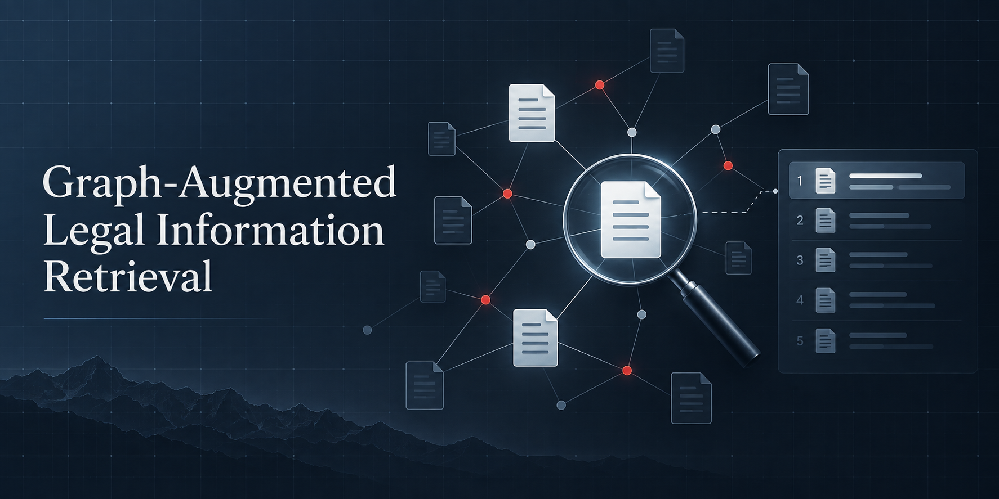
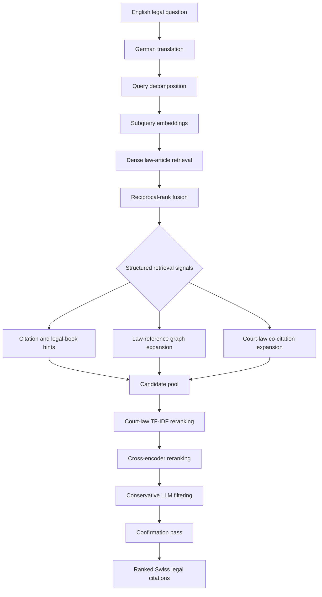
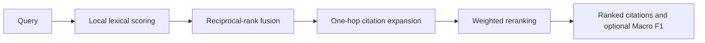

<div align="center">

# Graph-Augmented Legal Information Retrieval

**A research system for discovering citation-level Swiss legal sources in complex legal questions.**

[](https://github.com/sarthak11jain/Agentic-Legal-Information-Retrieval-System-/actions/workflows/ci.yml)
[](https://www.python.org/)
[](LICENSE)
[](https://www.kaggle.com/competitions/llm-agentic-legal-information-retrieval/leaderboard)



<a href="#overview">Overview</a> ·
<a href="#results-and-provenance">Results</a> ·
<a href="#research-system-architecture">Architecture</a> ·
<a href="#quick-start">Quick start</a> ·
<a href="#repository-guide">Repository</a>

</div>

> **Research software, not legal advice.** This project retrieves potentially
> relevant Swiss legal sources for research and experimentation. It does not
> determine legal outcomes or replace qualified legal advice.

## Overview

Complex Swiss-law questions can require several connected authorities rather
than one semantically similar document. The supported package demonstrates a
deterministic retrieval cascade: lexical candidate scoring, reciprocal-rank
fusion, one-hop citation expansion, weighted reranking, and citation-level
evaluation.

The repository has two deliberate layers:

| Layer | What it provides | Reproducibility |
| --- | --- | --- |
| **Supported package** | A typed, deterministic `legal_rag` package with local retrieval, reciprocal-rank fusion (RRF), one-hop graph expansion, weighted reranking, TOML configuration, and a synthetic demo | Runs locally without data, credentials, GPUs, or network access |
| **Competition archive** | The original Kaggle research scripts, prompts, and experiment implementation, including multilingual retrieval and model-assisted stages | Requires authorized competition data, precomputed artifacts, and optional model services |

This boundary is intentional: the public package makes the retrieval design
inspectable and runnable, while the archive preserves research provenance
without claiming that a clean checkout can reproduce the private competition
environment.

## Results and provenance

The competition system placed **44th out of 584 teams** on the completed
[Kaggle LLM Agentic Legal Information Retrieval competition](https://www.kaggle.com/competitions/llm-agentic-legal-information-retrieval).

| Result | Value | Source |
| --- | ---: | --- |
| Final private leaderboard rank | **44 / 584 teams** | Kaggle private leaderboard |
| Final private Macro F1 | **0.22252** | Kaggle private leaderboard |
| Best documented public Macro F1 | **0.27569** | Project experiment record |
| Initial public Macro F1 | **0.17058** | Project experiment record |
| Public-score improvement | **+61.6%** | Project experiment record |
| Retrieval target | Citation-level Swiss legal sources | Competition task |
| Research corpus | About **2.47M court-decision considerations**, plus federal-law articles | Authorized competition environment |

Private and public leaderboard scores use different hidden-test splits, so
they are not interchangeable. These are attributed competition results—not
metrics reproduced by the synthetic demo. See [evaluation notes](docs/evaluation.md)
and [condensed experiment history](docs/experiment-log.md) for the claim
boundary and provenance requirements.

## Research system architecture

The historical competition system combined multilingual query understanding,
dense retrieval, graph signals, reranking, and conservative LLM filtering.
The diagram describes the archived research pipeline; its data and model
dependencies are not bundled in this repository.



### Retrieval stages

| Stage | Role | Main signal |
| --- | --- | --- |
| Query understanding | Translate and decompose a scenario into focused German legal subqueries | Legal-intent coverage |
| Candidate generation | Search law-article embeddings for each subquery | Dense semantic similarity |
| Candidate fusion | Merge subquery rankings | Reciprocal-rank fusion |
| Graph expansion | Follow article references and court-law co-citation relationships | Structural connectivity |
| Reranking | Refine the expanded candidate pool | TF-IDF, co-citation, and cross-encoder signals |
| Final filtering | Remove weak citations only after a confirmation pass | Conservative LLM relevance judgment |

### Why graph augmentation?

Pure semantic similarity finds useful starting points, but it cannot fully
express how legal sources relate to one another. Citation edges and
co-citation signals can surface provisions or court decisions outside the
nearest embedding neighborhood. In the archived system, graph expansion was
combined with ranking signals rather than used as a substitute for retrieval.

## Quick start

The demo requires Python 3.10+ and no credentials, network connection, GPU, or
competition data.

```bash
python -m pip install -e .
legal-rag-demo
legal-rag-check
```

`legal-rag-demo` prints deterministic JSON for a tiny synthetic corpus. It is
an executable architecture example, not a benchmark evaluation.

## Supported package

The supported package is deliberately small and deterministic. It demonstrates
the core ranking architecture without misrepresenting the availability of the
original corpus, embeddings, or model services.

### Public API

```python
from legal_rag import CitationDocument, PipelineConfig, Query, run_pipeline

result = run_pipeline(
    Query("example-1", "Which sources address proportionality?"),
    [CitationDocument("Art. 5 BV", "Proportionality in administrative action.")],
    PipelineConfig(),
)
```

The public API consists of `Query`, `CitationDocument`, `RankedCitation`,
`PipelineResult`, `PipelineConfig`, `load_config`, and `run_pipeline`.
Pass a TOML file to `legal-rag-demo --config path/to/config.toml` to change
supported pipeline weights.

### Supported-package flow



## Working with the research archive

[`archive/competition-2026/`](archive/competition-2026/) keeps the original
competition code, prompts, and exploratory scripts for historical provenance.
It is not the maintained interface and is excluded from supported-code
coverage. The archive needs authorized competition inputs, precomputed
artifacts, optional dependencies, and selected model providers:

```bash
python -m pip install -e ".[archive]"
```

Read the [archive note](archive/competition-2026/README.md) and
[reproduction levels](docs/reproduction.md) before attempting to run it. Do
not publish competition data, hidden labels, derived label artifacts, model
weights, or credentials.

## Repository guide

```text
.
├── src/legal_rag/                 # Supported typed package and bundled assets
├── tests/                         # Unit, integration, CLI, and documentation checks
├── archive/competition-2026/      # Historical Kaggle implementation (unsupported)
├── docs/                          # Architecture, evaluation, data, and provenance notes
├── assets/social-preview.png      # Repository social-preview artwork
├── scripts/                       # Backward-compatible wrappers for package CLIs
├── pyproject.toml                 # Build metadata, dependencies, and quality-tool config
└── .github/                       # CI, Dependabot, issue templates, and PR template
```

| Document | Purpose |
| --- | --- |
| [Architecture](docs/architecture.md) | Supported package responsibilities and design |
| [Evaluation](docs/evaluation.md) | Metrics and competition-result provenance |
| [Experiment history](docs/experiment-log.md) | Condensed public-score progression |
| [Reproduction](docs/reproduction.md) | Supported versus archived execution paths |
| [Data and responsible use](docs/data.md) | Data boundary and legal-information scope |
| [Migration map](docs/migration-map.md) | Relationship between package and research archive |
| [Release checklist](docs/release-checklist.md) | Publication checks for future versions |

## Quality and contribution

The CI workflow installs the package and runs Ruff, strict type checking,
unit and integration tests, coverage for `src/legal_rag`, the synthetic CLI
demo, distribution build validation, archive syntax compilation, dependency
auditing, and secret scanning.

```bash
python -m pip install -e ".[dev]"
ruff check src tests scripts
mypy
coverage run -m unittest discover -s tests -p "test_*.py"
python -m build
```

Please read [CONTRIBUTING.md](CONTRIBUTING.md), [SECURITY.md](SECURITY.md),
the [Code of Conduct](CODE_OF_CONDUCT.md), and the [Changelog](CHANGELOG.md)
before opening an issue or pull request.

## License and citation

Source code is released under the [MIT License](LICENSE). Competition data and
third-party services remain governed by their original terms. See
[CITATION.cff](CITATION.cff) when citing this work.
