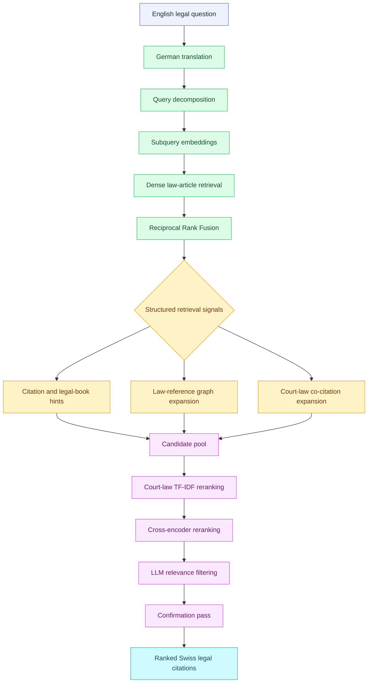
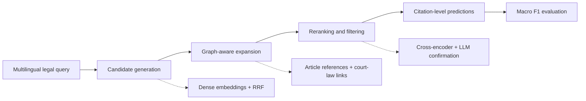

<div align="center">

# Graph-Augmented Legal Information Retrieval System

**An agentic retrieval pipeline for discovering citation-level Swiss legal sources for complex legal questions.**

[](https://github.com/sarthak11jain/Agentic-Legal-Information-Retrieval-System-/actions/workflows/ci.yml)
[](https://www.python.org/)
[](LICENSE)
[](https://www.kaggle.com/competitions/llm-agentic-legal-information-retrieval/leaderboard)

</div>

<p align="center">
  <a href="#overview">Overview</a> ·
  <a href="#results">Results</a> ·
  <a href="#system-architecture">Architecture</a> ·
  <a href="#reproduce">Reproduce</a> ·
  <a href="#repository-map">Repository</a>
</p>

> **Research project.** This repository contains the public implementation and technical documentation for a Kaggle legal information retrieval system. It is designed for source discovery and experimentation, not legal advice.

## Overview

The system retrieves Swiss legal citations relevant to a natural-language legal scenario. It treats retrieval as a structured reasoning problem: a relevant authority may be expressed in another language, referenced indirectly, or connected to the query through a chain of legal citations.

The pipeline combines multilingual query decomposition, dense retrieval, reciprocal-rank fusion, legal citation graphs, court-law co-citation signals, cross-encoder reranking, and conservative LLM-based filtering.

### Why graph augmentation?

Pure semantic similarity is useful for finding candidates, but it does not fully represent how legal sources relate to one another. Citation edges provide an additional signal: a retrieved article can lead to connected provisions and court decisions that are not among the nearest embedding neighbors.

## Results

| Result | Value |
| --- | ---: |
| Final private leaderboard rank | **44 / 584 teams** |
| Percentile | **Top 8%** |
| Final private Macro F1 | **0.22252** |
| Best documented public Macro F1 | **0.27569** |
| Initial public submission | **0.17058** |
| Public-score improvement | **+61.6%** |
| Retrieval target | Citation-level legal sources |
| Corpus scale | Approximately **2.47M court-decision considerations**, together with federal-law articles |

The final rank and private score come from the completed competition's [private leaderboard](https://www.kaggle.com/competitions/llm-agentic-legal-information-retrieval/leaderboard); Kaggle reports [584 participating teams](https://www.kaggle.com/competitions/llm-agentic-legal-information-retrieval/overview). Public and private scores use different hidden-test subsets and are not directly interchangeable. The public-score progression summarizes this project's documented submissions; additional validation results and ablations are recorded in [`docs/experiment-log.md`](docs/experiment-log.md).

<div align="center">

**44th of 584 teams (top 8%) · Best documented public Macro F1: 0.276**

</div>

## System architecture



### Retrieval stages

| Stage | Role | Main signal |
| --- | --- | --- |
| Query understanding | Translate and decompose the scenario into focused German legal subqueries | Legal intent coverage |
| Candidate generation | Search law-article embeddings for every subquery | Dense semantic similarity |
| Candidate fusion | Merge subquery rankings | Reciprocal Rank Fusion |
| Graph expansion | Follow article references and court-law co-citation relationships | Structural connectivity |
| Reranking | Refine the candidate pool and protect important procedural authorities | TF-IDF, co-citation, cross-encoder scores |
| Final filtering | Remove weak citations only when an LLM and confirmation pass agree | LLM relevance judgment |

## Technical approach

### 1. Query decomposition

The original scenario is translated and decomposed into focused German legal subqueries covering explicit legal questions, statutory definitions, legal characterization, remedies, procedural pathways, and general legal principles.

### 2. Dense retrieval and reciprocal-rank fusion

Each subquery is embedded and searched against law-article embeddings. Reciprocal Rank Fusion rewards candidates supported by multiple legal perspectives while preserving useful diversity across subqueries.

### 3. Citation-graph expansion

The system models relationships between legal sources through article references, book-level relationships, and court-document co-citations. This allows retrieval to move beyond the semantic neighborhood of the initial query.

### 4. Multi-stage reranking

The expanded candidate pool is refined using court-law co-citation features, TF-IDF-style weighting, and a cross-encoder. Procedural-law positions can be protected because general-purpose rerankers may undervalue procedural authorities.

### 5. Conservative LLM filtering

The final stage evaluates lower-ranked candidates using the German query, candidate article text, and court-usage context. A second confirmation pass is required before a citation is removed, keeping the LLM as a conservative filter rather than allowing it to replace retrieval.

## Research design



The public repository separates stable, testable primitives from the original research scripts. This makes the core retrieval, graph, reranking, metric, and LLM-decision logic easier to inspect without pretending that the full competition environment can be recreated without its data and model services.

## Reproduce

### Install

```bash
python -m venv .venv
.venv\Scripts\Activate.ps1       # Windows PowerShell
# source .venv/bin/activate     # macOS/Linux
pip install -r requirements.txt
```

### Run the data-free smoke demo

```bash
python scripts/run_demo.py
```

The demo exercises query-ranking fusion and one-hop citation-graph expansion using a tiny in-memory example. It is intentionally not a benchmark evaluation and does not require competition data.

### Inspect the research entry points

```bash
python scripts/check_environment.py
python scripts/run_law_retrieval.py --help
python scripts/run_llm_filter.py --help
```

The full research pipeline requires locally available competition files, precomputed embeddings, model/API configuration, and the directory layout documented in [`docs/reproduction.md`](docs/reproduction.md). The data boundary is described in [`docs/data.md`](docs/data.md).

## Repository map

```text
.
├── code/
│   ├── prepare/          # Corpus preparation, translation, and embeddings
│   ├── prompts/          # LLM prompt builders
│   ├── dev/              # Retrieval, graph, reranking, and service utilities
│   └── archives/         # Historical preprocessing utilities
├── src/legal_rag/        # Stable, testable public package primitives
│   ├── retrieval/        # RRF and score normalization
│   ├── graph/            # Citation-neighbor expansion
│   ├── reranking/        # Multi-signal score combination
│   ├── evaluation/       # Citation-level metrics
│   └── llm/              # Decision parsing and confirmation policy
├── scripts/              # Public entry points and smoke demo
├── configs/              # Documented research defaults
├── examples/             # Data-free example input
├── tests/                # Unit tests for core primitives
└── docs/                 # Architecture, evaluation, reproduction, and data notes
```

### Documentation guide

| Document | Purpose |
| --- | --- |
| [`docs/architecture.md`](docs/architecture.md) | Component responsibilities and system design |
| [`docs/pipeline.md`](docs/pipeline.md) | Detailed retrieval pipeline |
| [`docs/evaluation.md`](docs/evaluation.md) | Metrics and result interpretation |
| [`docs/experiment-log.md`](docs/experiment-log.md) | Experiments and ablations |
| [`docs/reproduction.md`](docs/reproduction.md) | Execution levels and setup |
| [`docs/data.md`](docs/data.md) | Data boundary and local schemas |
| [`docs/migration-map.md`](docs/migration-map.md) | Relationship between public package and research scripts |
| [`docs/architecture.mmd`](docs/architecture.mmd) | Editable Mermaid architecture source |
| [`docs/reusable-project-blueprint.md`](docs/reusable-project-blueprint.md) | Portfolio repository patterns reusable in future projects |

## Quality checks

The repository runs lightweight CI checks on every push and pull request:

```bash
python -m unittest discover -s tests -p "test_*.py"
python -m compileall -q src scripts code
python scripts/run_demo.py
```

## How to build a GitHub-friendly README

This README follows a reusable structure intended for technical reviewers, recruiters, and future collaborators. A strong project README should be easy to skim first and rewarding to study in depth.

### Recommended order

1. **Title and one-line summary** — Name the project clearly and explain the problem it solves in one sentence.
2. **Badges and navigation** — Show only useful signals such as CI status, language, license, and an official benchmark link. Add short anchor links when the document is long.
3. **Project disclaimer or scope** — State whether the project is research, production, educational, or experimental. Clarify important limitations early.
4. **Overview and motivation** — Explain the problem, why it matters, and what makes the approach technically interesting.
5. **Verified results** — Put the strongest official metric near the top. Identify the evaluation split, submission, or source of the number, and separate official results from experiments and illustrative demos.
6. **Architecture** — Add one readable diagram showing the main flow. Use a table to map each stage to its purpose and signal.
7. **Technical approach** — Explain the important design decisions in logical order. Focus on the reasoning behind the components, not a line-by-line tour of the code.
8. **Reproduction path** — Provide installation commands, a safe smoke demo, and links to the full setup. Make clear which steps require data, credentials, GPUs, or external services.
9. **Repository map** — Tell the reader where stable source code, scripts, tests, configuration, examples, and deeper documentation live.
10. **Quality and responsible-use notes** — Show how the project is tested, document data and licensing boundaries, and state where the system should not be trusted.
11. **References and license** — Link to the competition, paper, dataset, citation metadata, license, or other authoritative sources.

### What the README should focus on

- The project’s problem, outcome, and central engineering idea.
- The smallest set of details needed to understand the architecture.
- Results that can be traced to a real evaluation or experiment.
- A quick path for a reviewer to run or inspect something.
- Clear boundaries around data, secrets, reproducibility, and responsible use.

### What to avoid

- Leading with a long installation block before explaining the project.
- Presenting a toy demo as evidence of benchmark performance.
- Mixing exploratory experiments with the stable implementation without labelling them.
- Claiming production readiness when the repository still depends on unavailable data or services.
- Committing credentials, private data, hidden labels, generated caches, or large binary artifacts.
- Adding diagrams that are decorative, unreadable, or not tested in GitHub’s Markdown renderer.

The detailed, reusable checklist is available in [`docs/reusable-project-blueprint.md`](docs/reusable-project-blueprint.md). For future repositories, keep this information architecture and replace the domain-specific problem, architecture, metrics, data policy, and commands.

For a polished example of this style—using project highlights, architecture diagrams, reproduction instructions, experiment context, and deployment-oriented documentation—see the [sample Kaggle rental product recommendation README](https://github.com/rishaviitd/kaggle.rental.product.recommendation).

## Data and responsible use

Competition data, hidden labels, test queries, and derived labels are intentionally not committed to this repository. This keeps the public code aligned with the competition's data-sharing restrictions. See [`docs/data.md`](docs/data.md) for the local file contract.

This is a legal information retrieval system, not a legal-advice system. It ranks potentially relevant sources and does not determine the correct legal interpretation of a matter. Results may be incomplete, noisy, or sensitive to the corpus, language, model, and evaluation protocol.

## Competition and citation

- [LLM Agentic Legal Information Retrieval on Kaggle](https://www.kaggle.com/competitions/llm-agentic-legal-information-retrieval)
- [`CITATION.cff`](CITATION.cff)
- [`LICENSE`](LICENSE)

## License

The source code is released under the [MIT License](LICENSE). Competition data and derived artifacts are not included and remain subject to their original terms and the competition rules.
